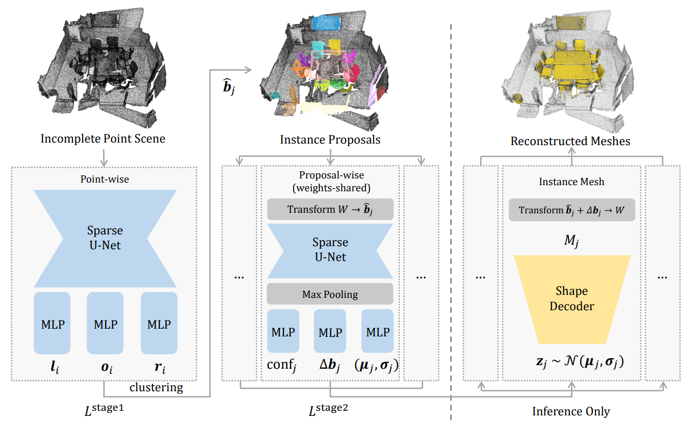

# Disentangled Instance Mesh Reconstruction (ECCV 2022)

This repository contains the official implementation for the paper: [Point Scene Understanding via Disentangled Instance Mesh Reconstruction](https://arxiv.org/abs/2203.16832).

### [Project Page](https://ashawkey.github.io/dimr/) | [Arxiv](https://arxiv.org/abs/2203.16832) | [Data](https://drive.google.com/drive/folders/1pzJ-PIe9pGjf0yNwfAU5zjQ4YMKJYbno?usp=sharing)





### Installation

Clone the repository:
```bash
git clone --recursive  https://github.com/ashawkey/dimr
cd dimr

pip install -r requirements.txt
```

Install dependent libraries:

The repository depends on a modified `spconv` from [pointgroup](https://github.com/dvlab-research/PointGroup) for sparse convolution, which requires CUDA version < 11 and pytorch < 1.5.

* spconv
  ```bash
  cd lib/spconv
  python setup.by bdist_wheel
  cd dist
  # may need to change the filename
  pip install spconv-1.0-cp37-cp37m-linux_x86_64.whl
  ```

* pointgroup_ops
  ```bash
  cd lib/pointgroup_ops
  python setup.py develop
  ```

* bspt_ops
  ```bash
  cd lib/bspt
  python setup.py develop
  ```

* light-field-distance
  ```bash
  cd lib/light-field-distance
  python setup.py develop
  ```


### Data Preparation

#### Full folder structure

```bash
.
├──datasets
│   ├── scannet
│   │   ├── scans # scannet scans
│   │   │   ├── scene0000_00 # only these 4 files are used.
│   │   │   │   ├── scene0000_00.txt
│   │   │   │   ├── scene0000_00_vh_clean_2.ply
│   │   │   │   ├── scene0000_00.aggregation.json
│   │   │   │   ├── scene0000_00_vh_clean_2.0.010000.segs.json
│   │   │   ├── ......
│   │   │   ├── scene0706_00
│   │   ├── scan2cad # scan2cad, only the following 1 file is used.
│   │   │   ├── full_annotations.json
│   │   ├── scannetv2-labels-combined.tsv # scannet label mappings
│   │   ├── processed_data # preprocessed data
│   │   │   ├── scene0000_00 
│   │   │   │   ├── bbox.pkl
│   │   │   │   ├── data.npz
│   │   │   ├── ......
│   │   │   ├── scene0706_00
│   │   ├── rfs_label_map.csv # generated label mappings
│   ├── ShapeNetCore.v2 # shapenet core v2 dataset
│   │   ├── 02954340
│   │   ├── ......
│   │   ├── 04554684
│   ├── ShapeNetv2_data # preprocessed shapenet dataset
│   │   ├── watertight_scaled_simplified
│   ├── bsp # the pretrained bsp model
│   │   ├── zs
│   │   ├── database_scannet.npz
│   │   ├── model.pth
│   ├── splits # data splits
│   │   ├── train.txt
│   │   ├── val.txt
│   │   ├── test.txt
```

#### Prepare the data

* download the preprocesssed data [here](https://drive.google.com/file/d/1lJUWMQ2g-a1r2QGjawpgU3jVCCqF-DLO/view?usp=sharing) (~3.3G) and label map [here](https://drive.google.com/file/d/18riZPYQxKhmlTw-0ku7paMxLAT9ZoNdp/view?usp=sharing), and put them under `./datasets/scannet`.

  If you want to process the data by yourself, please:
  
  * download the [ScanNet](http://www.scan-net.org/) dataset, [Scan2CAD](https://github.com/skanti/Scan2CAD) dataset, and the [ShapeNet](https://shapenet.org/) dataset, and put them to the corresponding locations.

  * preprocess ScanNet data by:

    ```bash
    python data/generate_data_relabel.py
    ```

    By default it launches 16 processes to accelerate processing, which will finish in about 10 minutes. Due to mismatching of instance labels and CAD annotations, it may log some warnings, but will not affect the process.
    It will generate the label map `./datasets/scannet/rfs_label_map.csv`, and save `data.npz, bbox.pkl` for each scene under `./datasets/scannet/processed_data/`.

* download the preprocessed ShapeNet (simplified watertight mesh) following [RfDNet](https://github.com/yinyunie/RfDNet) into `ShapeNetv2_data`, only the `watertight_scaled_simplified` is used for the mesh retrieval and evaluation.

* download the pretrained BSP-Net checkpoint and extracted GT latent codes [here](https://drive.google.com/file/d/1lKCrwM9aA9CWyD_baoIuxt7VCNV17WLR/view?usp=sharing).

  If you want to generate them by yourself, please check the [BSP_CVAE repository](https://github.com/ashawkey/bsp_cvae) to generate the ground truth latent shape codes (`zs` folder), the pretrained model (`model.pth`), and the assistant code database (`database_scannet.npz`).


### Training

```bash
# train phase 1 (point-wise)
python train.py --config config/rfs_phase1_scannet.yaml

# train phase 2 (proposal-wise)
python train.py --config config/rfs_phase2_scannet.yaml
```

Please check the config files for more options.

### Testing

Generate completed instance meshes:
```bash
# test after training phase 2
python test.py --config config/rfs_phase2_scannet.yaml
# example path for the meshes: ./exp/scannetv2/rfs/rfs_phase2_scannet/result/epoch256_nmst0.3_scoret0.05_npointt100/val/trimeshes/

# test with a speficied checkpoint
python test.py --config config/rfs_pretrained_scannet.yaml --pretrain ./checkpoint.pth
```

We provide the pretrained model [here](https://drive.google.com/file/d/1vYS7kD5bcQKQY-YjDtuty87yNVg4t1zf/view?usp=sharing).


To visualize the intermediate point-wise results:
```bash
python util/visualize.py --task semantic_gt --room_name all
python util/visualize.py --task instance_gt --room_name all
# after running test.py, may need to change `--result_root` to the output directory, check the script for more details.
python util/visualize.py --task semantic_pred --room_name all
python util/visualize.py --task instance_pred --room_name all
```

### Evaluation

We provide 4 metrics for evaulation the instance mesh reconstruction quality.
For the IoU evaluation, we rely on [binvox](https://www.patrickmin.com/binvox/) to voxelize meshes (via trimesh's API), so make sure it can be found in the system path.

```bash
## first, prepare GT instance meshes 
python data/scannetv2_inst.py # prepare at "./datasets/gt_meshes"

## assume the generated meshes are under "./pred_meshes"
# IoU
python evaluation/iou/eval.py ./datasets/gt_meshes ./pred_meshes

# CD
python evaluation/cd/eval.py ./datasets/gt_meshes ./pred_meshes

# LFD
python evaluation/lfd/eval.py ./datasets/gt_meshes ./pred_meshes

# PCR
python evaluation/pcr/eval.py ./pred_meshes
```

We provide the meshes used in our evaluation for reproduction [here](https://drive.google.com/file/d/1_z0nHZQ86-WApr3J0Lw1OV3fL4rrh_V4/view?usp=sharing), it includes the output meshes from `RfD-Net, Ours, Ours-projection, and Ours-retrieval`.

The GT meshes can also be found [here](https://drive.google.com/file/d/1ArUgyoSfXuSP34Asf0HrZYbd28yPm0vQ/view?usp=sharing).


### Citation

If you find our work useful, please use the following BibTeX entry:
```
@article{tang2022point,
  title={Point Scene Understanding via Disentangled Instance Mesh Reconstruction},
  author={Tang, Jiaxiang and Chen, Xiaokang and Wang, Jingbo and Zeng, Gang},
  journal={arXiv preprint arXiv:2203.16832},
  year={2022}
}
```

### Acknowledgement

We would like to thank [RfD-Net](https://github.com/yinyunie/RfDNet) and [pointgroup](https://github.com/dvlab-research/PointGroup) authors for open-sourcing their great work!